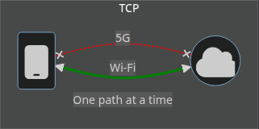
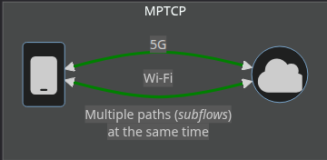

#  MPTCP_2025–2026

## Implémentation et analyse de Multipath TCP (MPTCP)
🇫🇷 Français | [🇬🇧 English](README_EN.md)

---

## 📌 Présentation du projet

Ce dépôt présente un **projet académique et technique** centré sur l’implémentation, l’analyse et la sécurisation du protocole **Multipath TCP (MPTCP)** dans un environnement virtualisé Linux.

Le projet consiste à **implémenter un noyau Linux intégrant MPTCP**, distinct de celui proposé nativement dans les versions récentes de Linux, puis à analyser les différences de comportement entre **TCP classique et MPTCP** dans un scénario réseau réaliste.

Ce travail s’inscrit dans le cadre du **"Projet Métier"** de l’ESAIP en 5ème année d'école d'ingénieur.

---

## 🎯 Objectifs du projet

* Comprendre le fonctionnement interne du protocole **MPTCP**
* Compiler et déployer un **noyau Linux MPTCP custom** sur machine virtuelle
* Comparer les flux **TCP vs MPTCP**
* Observer le trafic réseau et le comportement protocolaire
* Étudier les aspects **réseaux, cyber et performance**
* Mettre en place des **attaques ciblant MPTCP**
* Développer des **mécanismes de défense réseau**

---

## 🧱 Architecture du projet

Le projet repose sur une architecture en **trois machines virtuelles** :

* 🖥️ **Client** : génère des flux TCP et MPTCP
* 🌐 **Routeur** : point central d’observation et de contrôle
* 🗄️ **Serveur** : destination des flux réseau

### Rôle du routeur

Le routeur joue un rôle clé :

* Observation du trafic MPTCP via **eBPF**
* Analyse des sous-flux
* Détection de comportements anormaux
* Application de règles de défense (coupure de routes, filtrage, etc.)

---

## ⚙️ Travaux réalisés

### 🔹 Etat de l'art

Nous avons établi un état de l'art du MPTCP pour se renseigner sur ce qu'était cette technologie, ce qui existait comme application en particulier celles sur lesquelles nous allions travailler.

Voici un résumé rapide de ce qu'es le MPTCP et ce qu'il permet de faire:
Le MPTCP (MultiPath TCP) est une extension du protocole TCP traditionnel qui permet à deux hôtes de s'échanger des données en utilisant plusieurs chemins réseau simultanément au sein d'une seule et même connexion.

**Qu'est-ce que le Multi-path TCP ?**

* Multi-chemins : Contrairement au TCP standard qui est limité à une seule interface, le MPTCP peut diviser un flux de données sur plusieurs interfaces réseau (Wi-Fi, 4G, ou plusieurs liens Ethernet). 

* Sous-flux (Subflows) : Il crée des connexions TCP individuelles sur chaque chemin disponible et les agrège pour l'application. 

**Ce qu'il permet de faire**



*sources `https://www.mptcp.dev/`*

* Agrégation de bande passante : Cumuler les débits de chaque interface pour augmenter la vitesse globale de transfert. 

* Résilience et Fiabilité (Failover) : Si l'un des chemins (par exemple le "Chemin 1") subit une coupure, la connexion ne s'interrompt pas et bascule de manière transparente sur les autres chemins actifs. 

* Continuité de service : Permet de passer d'un réseau à un autre (mobilité) sans perdre la session en cours.

> Pour plus de détail: *[📶 état de l'art complet](doc/etat_d-art.md)*

### 🔹 Implémentation système

* Compilation d’un **noyau Linux intégrant MPTCP**
* Déploiement sur machine virtuelle
* Configuration du boot sur le noyau MPTCP

**[🐧 voir l'étape d'implémentation du noyau en détail](doc/mptcp_kernel_implementation.md)** 

* **[🌐 Etablissement des adresses réseaux et routage](doc/routing.md)**

### 🔹 Expérimentations réseau

* Échanges TCP classiques
* Échanges MPTCP
* Analyse comparative (latence, résilience, chemins multiples)

### 🔹 Observation & analyse

* Capture et analyse de trafic réseau
* Observation des flux MPTCP
* Instrumentation du routeur avec **eBPF**

### 🔹 Sécurité

* Scripts d’attaque ciblant MPTCP
* Scénarios de dégradation réseau
* Scripts de défense :

  * Coupure de routes
  * Désactivation de sous-flux
  * Réactions dynamiques côté routeur

---

## 🛠️ Technologies & outils utilisés

* **Linux** Ubuntu 22 LTS
* **MPTCP**
* **Machines virtuelles**
* **eBPF**
* **TCP/IP**
* Bash / scripts réseau
* Outils de capture et d’analyse réseau (Wireshark...)

---

## 📊 Résultats attendus

* Mise en évidence des différences entre TCP et MPTCP
* Analyse de la résilience de MPTCP face aux coupures de chemins
* Observation du comportement protocolaire via eBPF
* Évaluation de scénarios d’attaque et de défense

---

## 🎓 Contexte académique

* **École :** ESAIP
* **Nom du projet :** Projet Métier
* **Encadrant :** Mohammed BENCHEIKH (enseignant-chercheur sur le sujet)

### 👥 Équipe projet

* Benjamin EMEREAU
* Corentin VIGAN
* Matthis LE LIÈVRE

---

## 📂 Structure du dépôt (à venir)

```text
MPTCP_2025-2026/
├── docs/           # Documentation, analyses, rapports
├── images/         # Images utilisées dans les différents documents
├── kernel/         # Configuration et build du noyau MPTCP
├── scripts/        # Scripts d’attaque et de défense
├── ebpf/           # Programmes eBPF
└── README.md
```

---

## ⚠️ Avertissement

Ce projet est réalisé **à des fins pédagogiques et de recherche**. Les scripts d’attaque sont utilisés uniquement dans un environnement contrôlé.

---

## ✍️ Auteur

Projet réalisé dans le cadre académique de l’ESAIP – 2025–2026.
