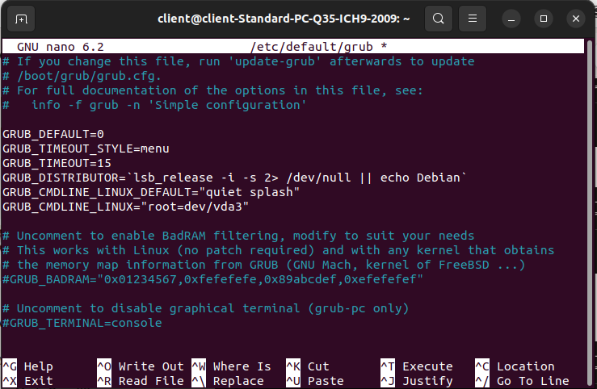

# Implémentation du Noyau MPTCP et Préparation des VMs (Ubuntu 22.04 LTS)

Ce document décrit la procédure manuelle d'installation du noyau supportant le protocole MPTCP (MultiPath TCP), la configuration du bootloader GRUB, ainsi que la personnalisation des machines virtuelles.


 ## 1. Installation du Noyau MPTCP
L'implémentation repose sur l'installation d'un noyau Linux spécifique ou compilé avec les options MPTCP activées. Bien qu'Ubuntu 22.04 LTS inclue nativement un support MPTCP (noyau 5.15+), l'utilisation d'un noyau personnalisé permet souvent d'accéder à des fonctionnalités de gestion de chemins plus avancées.

**Étape 1** : Dépendances et préparation<br>
Avant toute installation, assurez-vous que le système est à jour et possède les outils nécessaires à la gestion des paquets et des modules :

```bash
sudo apt update && sudo apt upgrade -y
sudo apt install git build-essential libncurses-dev bison flex libssl-dev libelf-dev -y
```
**Étape 2** : Téléchargement des paquets du noyau MPTCP<br>
Pour télécharger et installer les paquets du noyau, suivre le guide proposé à cette adresse :
[multipath-tcp.org](https://multipath-tcp.org/pmwiki.php/Users/AptRepository).  
Télécharger les fichier .deb de la version souhaitée sur le [repository github](https://github.com/multipath-tcp/mptcp/releases).  
Pour ce projet nous avons utilisé la version v0.95.3.

**Étape 3** : Installation des paquets du noyau<br>
Une fois les fichiers .deb du noyau téléchargés il faut les décompresser et les installer :

```bash
# Se placer dans le dossier contenant les fichiers .deb
sudo dpkg -i linux*.deb
sudo apt-get install -f
```

**Étape 4** : Vérification du déploiement<br>
Vérifiez que le nouveau noyau est bien présent dans le répertoire /boot avant de redémarrer :

```bash
ls /boot | grep vmlinuz
```
## 2. Configuration du GRUB (Choix du noyau au démarrage)
Pour garantir la flexibilité de vos tests, il est essentiel de pouvoir choisir entre le noyau MPTCP et le noyau standard au lancement de la machine.

Modification du fichier de configuration
Ouvrez le fichier de configuration principal du GRUB :

```bash
sudo nano /etc/default/grub
```
Appliquez les modifications suivantes pour rendre le menu de sélection visible :

Modifiez `GRUB_TIMEOUT_STYLE=hidden` par `GRUB_TIMEOUT_STYLE=menu`.

Ajustez `GRUB_TIMEOUT=5` pour disposer de 5 secondes pour effectuer votre choix.

(Optionnel) Utilisez `GRUB_DEFAULT=saved` et ajoutez `GRUB_SAVEDEFAULT=true` pour que le système démarre par défaut sur le dernier noyau sélectionné.  


Mise à jour et application  
Une fois le fichier enregistré, validez les changements pour régénérer le menu de boot :

```bash
sudo update-grub
```
Note : Au redémarrage, si le menu n'apparaît pas, maintenez la touche Shift (ou Échap) enfoncée. Sélectionnez "Advanced options for Ubuntu" pour choisir explicitement votre noyau MPTCP.

## 3. Clonage et Personnalisation des Machines  
Une fois la machine modèle ("VM Maître") configurée, nous procédons au clonage pour créer le Client, le Routeur et le Serveur.

**Étape 1** : Clonage intégral  
Dans votre hyperviseur (VirtualBox, VMware, ou KVM), effectuez un "Clone intégral".

⚠️ Attention : Cochez impérativement l'option "Réinitialiser les adresses MAC" pour éviter que les interfaces réseau n'entrent en conflit lors de la communication.

**Étape 2** : Renommage (Hostname)  
Pour faciliter l'identification dans la topologie, modifiez le nom d'hôte sur chaque machine :

```bash
# Sur la machine Client
sudo hostnamectl set-hostname Client-MPTCP

# Sur la machine Routeur
sudo hostnamectl set-hostname Routeur-MPTCP

# Sur la machine Serveur
sudo hostnamectl set-hostname Serveur-MPTCP
```
**Étape 3** : Renommage de l'utilisateur (Optionnel)  
Pour un rendu propre, vous pouvez renommer l'utilisateur par défaut pour qu'il reflète le rôle de la machine :

Définissez un mot de passe root pour l'opération : `sudo passwd root`.

Déconnectez-vous et passez en console TTY (Ctrl+Alt+F3).

Connectez-vous en tant que root et lancez les commandes suivantes :

```bash
# Exemple pour passer de 'user' à 'client'
usermod -l client -d /home/client -m ancien_nom_utilisateur
groupmod -n client ancien_nom_utilisateur
```
## 4. Vérification finale  
Après avoir redémarré sur chaque machine avec le bon noyau, vérifiez que la pile MPTCP est bien active et reconnue par le système :

```bash
# Vérification des limites de subflows (doit renvoyer des valeurs numériques)
ip mptcp limits show
```
Vous êtes maintenant prêt à appliquer les configurations Netplan  ainsi que les scripts de routage adaptés aux interfaces de chaque machine.

[⮌ Retour au Readme général](../README.md)
