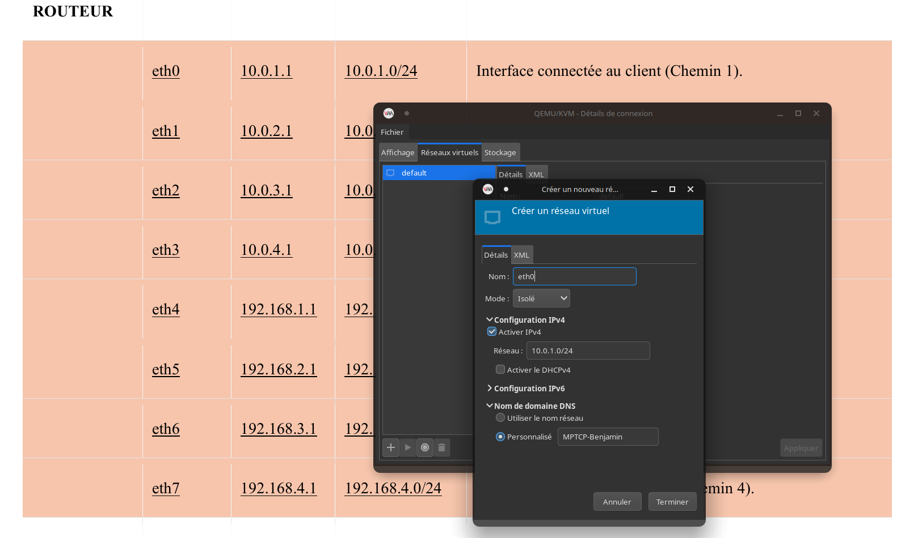

# Configuration du Routage Inter-Machines (MPTCP)
Ce document détaille la configuration réseau permettant la communication multi-chemins entre le Client et le Serveur via le Routeur.

## 1. Architecture du Réseau
Une table de routage classique est établie avec plusieurs routes statiques nous permettant d'être sur de quel chemins prennent les données et ainsi faire des opérations sur le réseau.

[📄 Ouvrir La topologie complete en PDF](Description_de_la_Topologie_Réseau_MPTCP.pdf)


Il faut ajouter des interfaces a chaques carte pour qu'elles puissent les utiliser ensuite.

* **4 interfaces MPTCP** coté client *(10.0.X.10)*
* **4 interfaces MPTCP** coté serveur *(192.168.X.10)*
* **8 interfaces sur le routeur** (4 côté client, 4 côté serveur)



### Etape manuelle: 
Il est possible de configurer toutes les interfaces à la main, lors du routage sur nos machines virtuelles personnelles que nous avons fait sur nos ordinateurs respectifs, nous avons optés pour une configuration netplan, une application de toute la configuration réseau via un fichier.
Cela permet d'accélérer la phase de routage.

> ❗ Le routage suivant ne permet pas aux machines d'utiliser internet. Elles doivent en être coupées pour être dans un réseau fermé lors des tests MPTCP.

### 📘 Possibilité de faire toute cette configuration à la main (travail de réseau de base)

### 📗 Configuration des interfaces par Netplan (script) - Création des fichiers:

Récupérer les fichiers netplan correspondants à la topologie réseau choisie:

* **Routeur :** [`99-mptcp-router.yaml`](./netplan/routeur_netplan.yaml) — *Gère le transfert de paquets entre les deux sous-réseaux.*
* **Client :** [`99-mptcp-client.yaml`](./netplan/client_netplan.yaml) — *10.0.X.X/24*
* **Serveur :** [`99-mptcp-server.yaml`](./netplan/serveur_netplan.yaml) — *192.168.X.X/24*
___
Sur chaque machine que l'on configure, on commence par récupérer le **nom des adresses** créé par la machine:

```bash
ip link
```
Puis on **créé le fichier** sur la machine et on ajoute le contenu:

```bash
sudo nano /etc/netplan/99-mptcp-router.yaml
```
> 💡 pour la propreté, il est préférable d'adapter le nom du fichier.
> exemple: **99-mptcp-client.yaml** ,**99-mptcp-serveur.yaml** etc..

On change les droits de ce fichier pour que le netplan ne soit accessible que par *`root`*.
```bash
sudo chmod 600 /etc/netplan/01-network-manager-all.yaml
# a adapter si vous avez changé le nom:
sudo chmod 600 /etc/netplan/99-mptcp-routeur.yaml 
sudo chown root:root /etc/netplan/*.yaml
```

Après avoir créé le fichier sur la machine correspondante, on peut vérifier les changement qui seront appliqués:

```bash
# ne dois rien renvoyer
sudo netplan generate
# permet d'activer networkd si il ne l'es pas déjà
sudo systemctl enable systemd-networkd-wait-online --now
```
> 💡Adapter la configuration en fonction de ces warning. voir sur internet

Puis appliquer les changements pour de bon:

```bash
sudo netplan apply
```
* On peut s'assurer du résultat avec `sudo netplan try`

Pour finir, la vérification de l'application de la configuration:

```bash
ip r
```
*sortie : vous devriez voir les différentes adresses comme l'exemple ci-dessous:*
*Nous pouvons y voir deux adresse **default** qui viennent d'une connexion par pont avec mon ordinateur*


## 🛜 Spécifique Routeur:
Pour que le routeur fasse sont travail de **'pont'** entre les deux machines, il est important d'activer le **transfer de paquet**:

```bash
# Activation du pont de routage
sudo sysctl -w net.ipv4.ip_forward=1
# pour le rendre permanent:
echo "net.ipv4.ip_forward=1" | sudo tee /etc/sysctl.d/99-mptcp.conf
```
___
## 2- Application de script de routage sur client et serveur

On applique des scripts pour faire la configuration des routes statiques spécifiant quel routes sont utilisables.

* **Client :** [`script client`](./script_client.md)
* **Serveur :** [`script serveur`](./script_serveur.md)
* **Routeur :** [`script routeur`](./script_routeur.md)


## *Vérification:*

**Ping de base**

Sur le client, faire `ping 192.168.1.10` 

**Vérification MPTCP**

utiliser `ip mptcp endpoint show` pour voir si les interfaces sont bien enregistrées

**Tester les multi-chemins exemple (optionnel, puisque prochaines étapes du projet):**

 1- Installer `mptcpize` ou utiliser `iperf3` pour .
 2- Lancer un transfert et vérifiez avec nload ou iftop sur le routeur si les 4 interfaces reçoivent du trafic simultanément.

[⮌ Retour au Readme général](../README.md)


